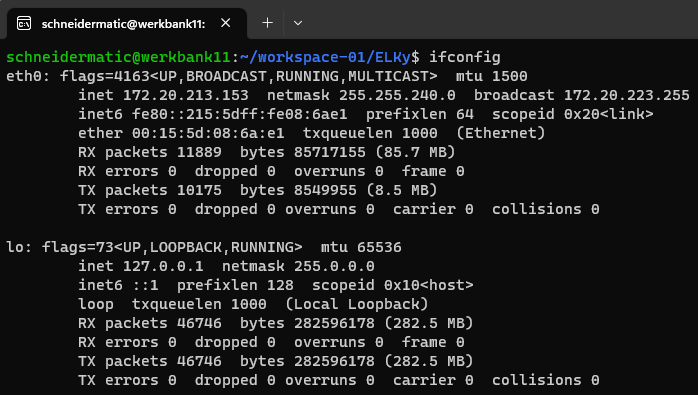
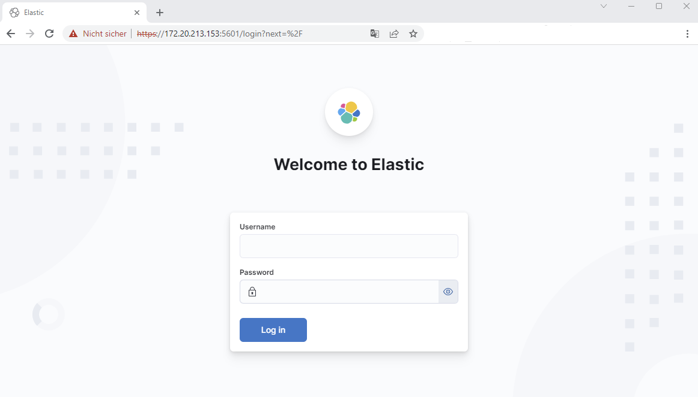

# Activate Self-Monitoring

This recipe describes how you can activate elastic's self-monitoring for the components:

- Elasticsearch
- Logstash
- Kibana

01. Start the ELK-Stack with docker-compose

        ubuntu~$> cd $HOME/ELKy/stack
        ubuntu~$> docker-compose up -d

02. Get your IP-Address with ifconfig

        ubuntu~$> ifconfig

    

03. Log into Kibana
        https://<YourIPAddress!!!>:5601

    

    **user: elastic**\
    **password: changeme**

04. TODO - Describe further actions ...